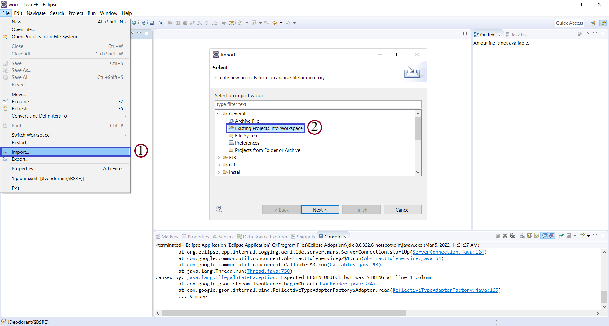
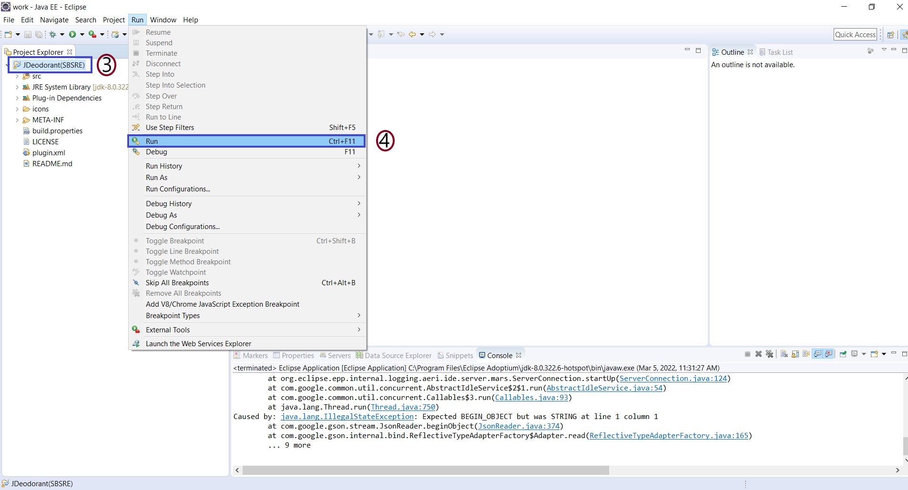
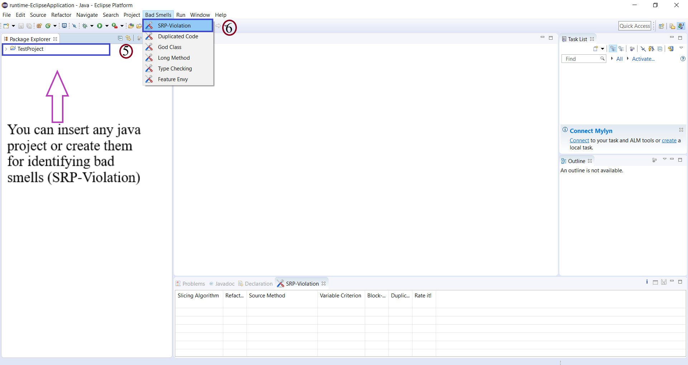
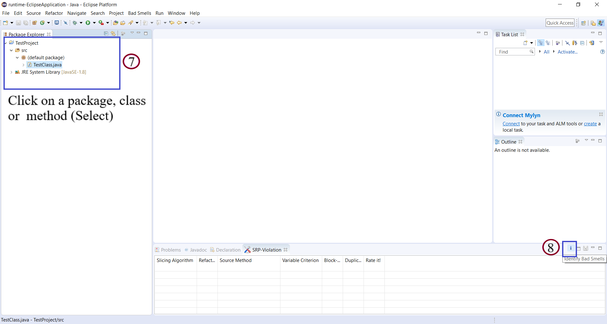
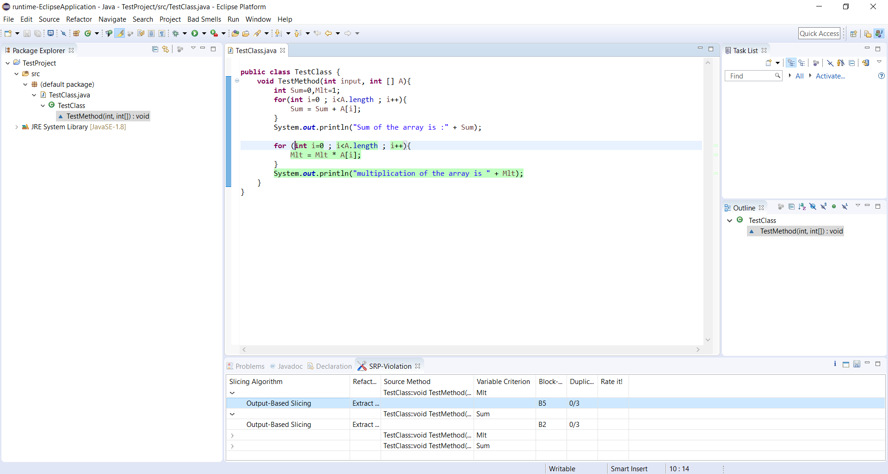

# SBSRE
SBSRE is a **slice-based single responsibility extraction** approach supported by an **eclipse plugin** for identifying Single responsibility violations in the methods.

The responsibility of a method can be best described by its impacts on the outer scope that are exposed through modifying the return values, outputs, and global variables. In the context of object-oriented programming, a method may modify either the class fields or return a value to its caller method. If the corresponding slices of these fields or return values within the method body are entirely separate, the method presumably exposes different functionalities.

Existing extract method refactoring tools do not pay serious attention to these so-called output instructions and the output variables while searching for extract method candidates, which results in imprecise refactoring opportunity detection from the developer's viewpoint. We introduce a new **Output-based Slicing** algorithm, focused on extracting chunks of codes that commit to the specific output from the body of long methods.

## Relevant publications
Published version: Supporting single responsibility through automated extract method refactoring (https://link.springer.com/article/10.1007/s10664-023-10427-3)
 
Preprint version: Supporting single responsibility through automated extract method refactoring (https://arxiv.org/abs/2305.03428)

## Getting started

### Step1: Prerequisites

It is recommended to use the Eclipse Neon IDE with JDK 1.8.x for lunching our SBSRE tool 

* [Download Eclipse Neon](https://www.eclipse.org/downloads/packages/release/neon/3/eclipse-ide-java-ee-developers)

* [Download JDK 8](https://www.oracle.com/java/technologies/downloads/)

### Step2: Import the SBSRE tool

 Import the SBSRE tool in the Eclipse IDE

  

 Figure 1. Operations of Step 2. 

### Step3: Run the SBSRE tool 

Run the SBSRE tool as as a plugin in the Eclipse IDE

  

 Figure 2. Operations of Step 3. 

### Step4: Open SRP-Violation window

Insert or create a java project, then on Bad Smells tab, choose SRP-Violation

  

 Figure 3. Operations of Step 4. 

### Step5: Identifying SRP-Violation

By clicking on each of the packages, classes, or methods, it will be selected. Then by clicking on the "i" icon, results will be shown.

  

 Figure 4. Operations of Step 5. 

### Step6: 

Results are shown here and by selecting each of them, a code fragment proposed for method extraction will be highlighted.

  

 Figure 5. Operations of Step 6. 

