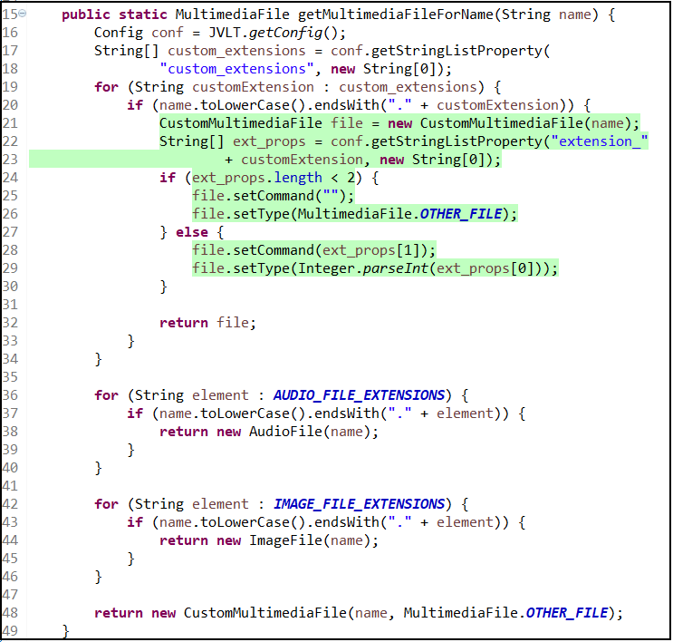
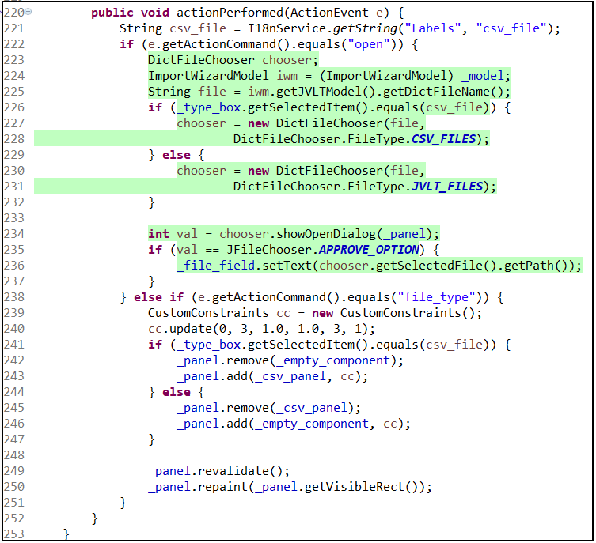

# Motivation Examples

This section offers motivational examples to illustrate the significance of focusing on multiple output instructions to address SRP violations. Additionally, it showcases the SBSRE tool's capability to identify extract method opportunities for methods with multiple output instructions.

## Example 1

### Source code
JVLT project (https://jvlt.sourceforge.io/)

### Extract method provided by SBSRE tool 
lines (21 to 29)

### Description

This Java method, "getMultimediaFileForName," takes a "name" as input and gives back a "MultimediaFile" based on the name's file extension. This method has four different return statements. In three cases, it simply returns results without much work. However, in the first case (line 32), it does some calculations between lines 21 to 29. This makes the method do two different things: converting the "name" into a "MultimediaFile" and doing calculations for the first case.

The important thing to note here is that even though extracting lines 21 to 29 won't reduce the number of return statements in "getMultimediaFileForName" (they can't be reduced automatically), it helps make the method more focused on its primary responsibility, which is converting the "name" into a "MultimediaFile."

Focusing on the output instructions, the idea of the SBSRE tool, the calculation of each output instruction can be extracted if required.

  

 Example 1 

## Example 2

### Source code
JVLT project (https://jvlt.sourceforge.io/)

### Extract method provided by SBSRE tool 
lines (223 to 236) 

### Description

We can consider two output variables for this method, or somehow, there are two ways to output data/values from it. Two class fields, or variables defined outside the method," _file_field" and "_panel." Each of them is a way for output. The interesting point is that if each of these two parts is executed, the other part is not executed. It seems that they are different in terms of calculations, which is why each of these two parts (223 to 236) or (239  to 250) can be a separate method.

  

 Example 2 

